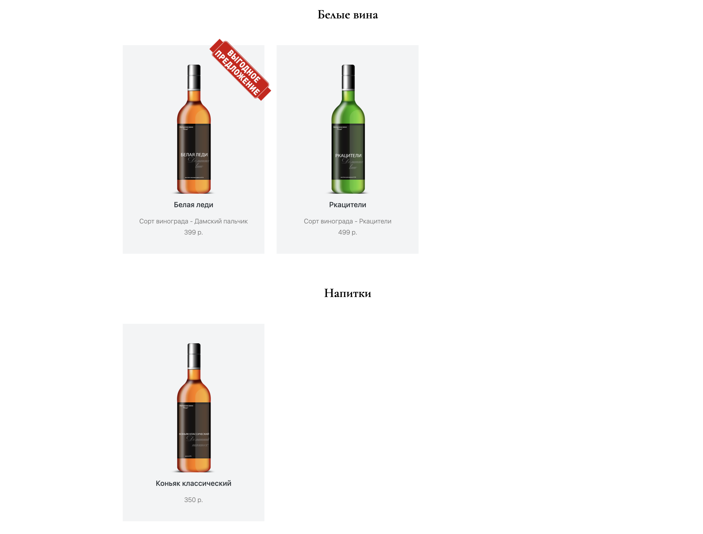

# Новое русское вино

Сайт магазина авторского вина "Новое русское вино".

## Настройка

---
Python3 должен быть уже установлен. Скачайте код и используйте `pip` для установки зависимостей (или `pip3`, если есть конфликт с Python2):
```shell
pip install -r requirements.txt
```
### Каталог продукции

Для работы скрипту необходим Excel-файл `products.xlsx` с каталогом продукции. В нем обязательно должны присутствовать столбцы:
- Категория
- Название
- Сорт (может быть пустым у не вин)
- Картинка (имя файла изображения без указания полного пути)

Пример входных данных приведен ниже:

| **Категория** | **Название**        | **Сорт**        | **Цена** | **Картинка**              |
|---------------|---------------------|-----------------|----------|---------------------------|
| Белые вина    | Белая леди          | Дамский пальчик | 399      | belaya\_ledi.png          |
| Напитки       | Коньяк классический |                 | 350      | konyak\_klassicheskyi.png |
| Белые вина    | Ркацители           | Ркацители       | 499      | rkaciteli.png             |

Приведет к такому выводу:



## Запуск

---
Запустите сайт командой 
```shell
python3 main.py
```
Перейдите на сайт по адресу [http://127.0.0.1:8000](http://127.0.0.1:8000).

Для завершения работы сервера, нажмите сочетание клавиш `Ctrl-C` в терминале.
## Цели проекта

Код написан в учебных целях — это урок в курсе по Python и веб-разработке на сайте [Devman](https://dvmn.org).
